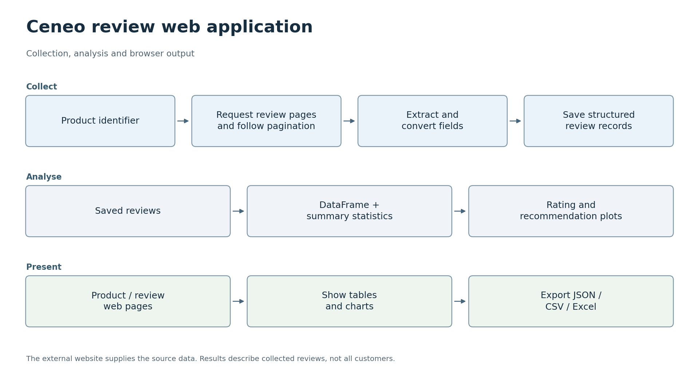

# 상품 리뷰 웹 애플리케이션

[한국어](#korean) · [English](#english)

## 한국어

상품 리뷰를 수집하고 살펴보기 위한 Flask 수업 과제 애플리케이션입니다. 사용자가 상품 식별자를 입력하면 애플리케이션이 리뷰 필드를 파싱하고 데이터를 정리한 뒤, 브라우저 페이지와 내보내기 라우트를 통해 제공합니다.

라우트 처리 함수는 [app/routes.py](app/routes.py)에 있습니다. 파싱과 변환을 위한 보조 함수는 [app/utils.py](app/utils.py)에 있습니다. 별도의 [분석 노트북](https://github.com/oldprize47-SH/ceneo-review-analysis)은 이와 관련된 노트북 작업 흐름을 다룹니다.

### 프로젝트 목표

상품 리뷰를 수집해 요약, 차트, 내보내기 기능을 갖춘 웹 인터페이스로 제공하여 리뷰를 더 쉽게 살펴볼 수 있도록 합니다.

AI로 생성한 콘셉트 일러스트입니다. 기기의 외형, 인터페이스 배치, 예시 그래픽은 설명을 위한 표현이며, 실제 프로젝트 사진이나 측정 결과가 아닙니다.

### 활용할 수 있는 곳

이 작업 흐름은 리뷰 텍스트를 평점 및 추천 여부의 분포와 함께 읽으면서 수집된 상품 피드백을 살펴보는 데 도움이 될 수 있습니다. 구조화된 리뷰 레코드를 보관하면 모든 페이지를 다시 수집하지 않고도 분석을 반복할 수 있습니다. 요약을 읽을 때는 수집된 표본에 관한 결과이며 전체 고객을 대표하지 않는다는 점을 함께 참고하면 좋습니다. 수집 가능 여부는 원본 사이트와 허용된 접근 범위에 따라 달라집니다.

### 한눈에 보기

문서화된 프로젝트 내용과 코드를 바탕으로 흐름을 살펴볼 수 있도록 재구성했습니다. 아래 설명에서 결과와 함께 검증한 범위와 한계를 확인할 수 있습니다. [SVG](docs/flowcharts/ceneo-web.svg)

### 상품 번호에서 리뷰 페이지까지

추출 폼은 상품 ID를 Flask 라우트로 전달합니다. 해당 라우트는 상품의 리뷰 페이지를 요청하고, BeautifulSoup으로 리뷰 필드를 파싱하며, 수집이 끝날 때까지 다음 페이지 링크를 따라갑니다. 보조 함수는 평점과 추천 여부 같은 텍스트 필드를 분석하기 쉬운 값으로 변환합니다. 폴란드어 리뷰 텍스트를 위한 번역 보조 함수도 있습니다.

애플리케이션은 리뷰 레코드와 상품 요약을 JSON 파일에 저장합니다. 이후 Pandas로 리뷰 수, 평균 점수, 평점·추천 여부 분포를 계산하고, Matplotlib으로 브라우저 페이지에 사용할 차트를 저장합니다. 상품 페이지는 리뷰 표를 보여 주며, 내보내기 라우트는 JSON, CSV, XLSX 다운로드를 제공합니다. 이 구현은 데이터베이스 기반 서비스 대신 로컬 파일을 사용해 이러한 작업을 수행합니다.

### 소스 읽기

[app/routes.py](app/routes.py)부터 읽으면 폼 제출, 수집, 저장, 상품 페이지로의 리다이렉트를 차례로 따라갈 수 있습니다. [app/utils.py](app/utils.py)를 함께 읽으면 필드 선택자와 변환 과정을 확인할 수 있습니다. [템플릿](app/templates)은 저장된 정보를 어떻게 보여 주는지 나타냅니다. [노트북 프로젝트](https://github.com/oldprize47-SH/ceneo-review-analysis)를 이용하면 수집과 분석 단계를 따로 살펴보기 쉽습니다.

이 아카이브는 Sangheon Park가 2024년 크라쿠프 경제대학교(Krakow University of Economics) 교환학생으로 수행한 수업 과제에서 비롯되었습니다. 라우트, 파싱 보조 함수, 템플릿이 위에서 설명한 애플리케이션을 구성합니다. 기여 범위를 살펴볼 때는 현재 확인 가능한 기록을 기준으로 합니다. 이 기록만으로는 별도의 팀 역할이나 제공된 모든 기본 틀의 개인별 저작자를 확정할 수 없어, 추가적인 기여자별 역할 구분은 제시하지 않습니다.

### 로컬에서 실행하기

기존 실행 진입점은 `python run.py`입니다. 의존성은 [requirements.txt](requirements.txt)에 기록되어 있지만, 해당 환경을 새로 설치해 확인하지는 않았습니다. 일부 패키지는 특정 플랫폼에 종속됩니다. 구성을 재현하려면 별도의 Python 환경에서 이 파일을 먼저 검토하는 것이 좋습니다. 소스는 웹사이트 마크업과 원격 요청에도 의존합니다. 따라서 환경 설치에 성공한 뒤에도 현재 추출 기능이 작동하는지는 별도로 확인해야 합니다.

원래 애플리케이션은 가져오기 시점에 개발 서버를 시작하고 디버그 모드를 활성화합니다. 배포 전에 조정이 필요합니다. Python 파일의 문법은 검사했지만, 이번 포트폴리오 갱신 중에는 서버, 스크레이퍼, 번역 요청을 실행하지 않았습니다.

리뷰와 상품 콘텐츠의 권리는 원래 작성자와 플랫폼에 있습니다. 이 사본은 공개 수업 아카이브를 보존하며, 새로 수집한 리뷰를 추가하지 않습니다.

[원본 저장소](https://github.com/sangheon47/CeneoWebScraperSH). 원래 이력과 저작자 표기를 유지합니다.

---

## English

**Product Review Web App**

This is a Flask coursework application for collecting and examining product reviews. A user supplies a product identifier, and the application parses review fields, prepares the data and presents it through browser pages and export routes.

The route handlers are in [app/routes.py](app/routes.py). Parsing and conversion helpers are in [app/utils.py](app/utils.py). The separate [analysis notebooks](https://github.com/oldprize47-SH/ceneo-review-analysis) cover the related notebook workflow.

### Project goal

Make product reviews easier to explore by collecting them into a web interface with summaries, charts and exports.

AI-generated concept illustration. Device appearance, interface layout and example graphics are illustrative, not project photographs or measured results.

### Where it could be used

The workflow could help someone explore collected product feedback by reading review text alongside rating and recommendation distributions. Keeping structured review records also makes it possible to repeat an analysis without recollecting every page. When reading the summaries, keep in mind that they describe the collected sample and do not represent all customers. Collection depends on the source site and permitted access.

### At a glance

This overview helps you follow the project through its documentation and code. The sections below explain the results and the limits of verification. [SVG](docs/flowcharts/ceneo-web.svg)

### From a product number to a review page

The extraction form passes a product ID to a Flask route. That route requests the product's review page, parses the review fields with BeautifulSoup and follows the next-page link until collection ends. The helper functions convert text fields such as ratings and recommendations into values that are easier to analyse. Translation helpers are also present for Polish review text.

The application stores review records and a product summary in JSON files. It then uses Pandas to compute review counts, average scores and rating/recommendation distributions, and Matplotlib to save charts for the browser pages. A product page presents a review table, while export routes provide JSON, CSV and XLSX downloads. The implementation uses local files for this workflow rather than a database-backed service.

### Reading the source

Start with [app/routes.py](app/routes.py) to follow form submission, collection, storage and the redirect to a product page. Read [app/utils.py](app/utils.py) alongside it to see the field selectors and transformations. The [templates](app/templates) show how the stored information is presented. The [notebook project](https://github.com/oldprize47-SH/ceneo-review-analysis) makes the collection and analysis steps easier to inspect separately.

This archive comes from Sangheon Park's 2024 exchange-student coursework at Krakow University of Economics. The routes, parsing helpers and templates form the application described above. For attribution, the description stays within the available records. These do not establish separate team roles or individual authorship of every supplied scaffold, so an additional contributor split cannot be given.

### Running locally

The historical entry point is `python run.py`. Dependencies are recorded in [requirements.txt](requirements.txt), but that environment has not been freshly installed. Some packages are platform-specific. A useful first step is to review that file in a separate Python environment before recreating the setup. The source also depends on website markup and remote requests. After installing the environment, extraction would still need a separate check to establish whether it currently works.

The original application starts its development server during import and enables debug mode. It needs adjustment before deployment. The Python files were checked for syntax; the server, scraper and translation requests were not run during this portfolio update.

The reviews and product content belong to their original authors and platform. This copy preserves the public course archive and does not add newly collected reviews.

[Original repository](https://github.com/sangheon47/CeneoWebScraperSH). Original history and attribution are retained.
