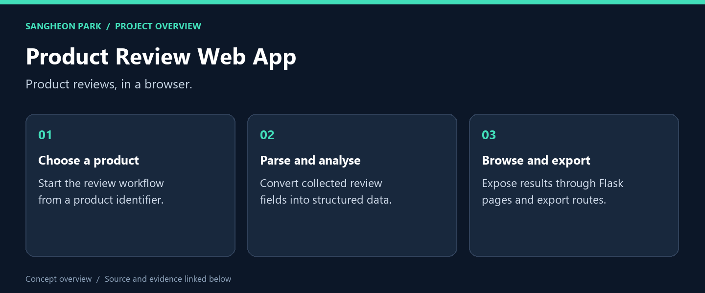
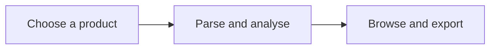

# Product Review Web App

**A Flask application linking review extraction, data processing and a browser interface.**

[What I built](#what-i-built) · [My role](#my-role) · [Code and reproduction](#code-and-reproduction) · [Portfolio](https://github.com/oldprize47-SH)

## What I built

| Deliverable | What it does | Explore |
|---|---|---|
| **Web routes** | Pages, extraction and export endpoints | [Source / result](app/routes.py) |
| **Data helpers** | Parsing and conversion logic | [Source / result](app/utils.py) |
| **Entry point** | Historical local development entry | [Source / result](run.py) |

### Result at a glance

Python syntax checked. The server and live collection were not run; the archived debug setup is for local development.

## My role

This fork preserves the existing public application and its history. It does not claim ownership of the reviewed products, review text or upstream platform.

## How it works

## Code and reproduction

## Inspect before running

The original application starts the development server during import and enables
debug mode. The historical entry point is `python run.py` after environment setup;
this is a local coursework workflow, not a production deployment instruction.
The pinned dependency snapshot includes platform-specific packages and has not
been freshly installed in this pass.

Python source parsed successfully on 2026-09-28. No server, scraper, translation
request or new review collection was run. Existing review exports remain inherited
public archive material; no new personal data was added.

[Related analysis notebooks](https://github.com/oldprize47-SH/ceneo-review-analysis)

## Source and credits

[Original repository](https://github.com/sangheon47/CeneoWebScraperSH) · [Portfolio home](https://github.com/oldprize47-SH)

[Original README](README.original.md) is retained alongside the source history.

Course scaffolding, team contributions and third-party assets retain their original attribution. This documentation does not grant a new licence.
