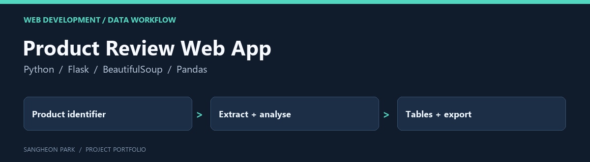

# Product Review Web App

A Flask coursework application that connects product-review collection, analysis and a browser interface. It is supplementary software experience alongside the embedded/control portfolio.

[Portfolio home](https://github.com/oldprize47-SH) · [Original repository](https://github.com/sangheon47/CeneoWebScraperSH)

[Original project README](README.original.md)

## Contribution and context

This fork preserves the existing public application and its history. It does not claim ownership of the reviewed products, review text or upstream platform.

## Code map

| Entry | Purpose |
|---|---|
| [run.py](run.py) | Imports the Flask application |
| [app/__init__.py](app/__init__.py) | Historical development-server startup |
| [app/routes.py](app/routes.py) | Pages, extraction and export routes |
| [app/utils.py](app/utils.py) | Parsing and data-conversion helpers |
| [requirements.txt](requirements.txt) | Recorded dependency snapshot |

## Inspect before running

The original application starts the development server during import and enables
debug mode. The historical entry point is `python run.py` after environment setup;
this is a local coursework workflow, not a production deployment instruction.
The pinned dependency snapshot includes platform-specific packages and has not
been freshly installed in this pass.

Python source parsed successfully on 2026-09-28. No server, scraper, translation
request or new review collection was run. Existing review exports remain inherited
public archive material; no new personal data was added.

[Related analysis notebooks](https://github.com/oldprize47-SH/ceneo-review-analysis)

## Archive policy

The fork retains upstream history, source attributions and course material. The
portfolio documentation does not assign a new licence or claim sole authorship
of inherited code. Current checks are stated above; an untested component is not
presented as verified.
